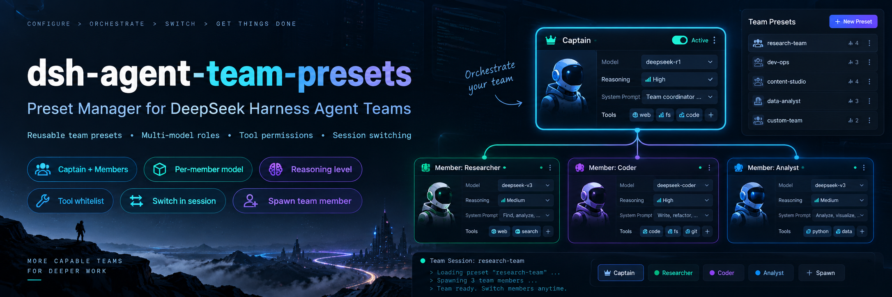

# dsh-agent-team-presets



English | [中文](README.zh.md)

> **Status: community plugin v0.1.3.** Install the pinned release with
> `dsh plugin --profile <profile> add github:bloodarea/dsh-agent-team-presets#v0.1.3`.
> The supported Harness peer range is `>=0.2.0-rc.1 <0.3.0`, checked by the plugin
> manager; the Harness version is not this plugin's version. Plugin details for
> `dsh-agent-team-presets` should show `v0.1.3`. A card naming
> `@deepseek-ai/dsh-experimental-agent-team-presets` instead is the monorepo
> development package, whose version follows the Harness (for example,
> `0.2.0-rc.2`), not this community release. `lib/` ships prebuilt; rebuilding
> source needs a Harness checkout — see [DEVELOPMENT.md](DEVELOPMENT.md) and
> [CHANGELOG.md](CHANGELOG.md).

## Summary

`dsh-agent-team-presets` adds a Settings page that configures named Agent Teams and a composer control that applies one Team to a Session. A Team has a captain and any number of members: the captain carries its own prompt and tool policy, while each member also carries its own provider/model route and reasoning effort, read from the stored Team each time that member is summoned. Applying a Team installs the captain's prompt, restricts its tools, and registers `spawn_team_member`, which summons a member with that member's own persona, route, effort, and tools. A captain leads on the model the Session already selected.

<a id="project-introduction"></a>
## Project introduction

> Turn DeepSeek Harness Agent Teams from ad-hoc lineups into configurable, reusable professional AI teams.

**dsh-agent-team-presets** is a visual Agent Team preset manager for DeepSeek Harness. It configures roles, per-member models, reasoning effort, system prompts, and tool permissions, so a professional AI team is configured once and reused on demand.

<a id="why-this-plugin"></a>
## Why this plugin?

DeepSeek Harness already ships Agent Teams with multi-agent collaboration, but it leaves room in per-team configuration and reuse.

This plugin addresses five gaps:

- **Teams are hard to reuse.** Native teams focus on runtime creation and collaboration and offer no visual preset management; this plugin saves, duplicates, and reuses team configurations.
- **Role setup is repetitive.** Member responsibilities no longer have to be re-described every time: each role's name, description, and system prompt are configured in advance.
- **Splitting work across models is awkward.** Every member picks its own model and reasoning effort, so one team combines models by task; the captain keeps leading on the model the session already selected.
- **Tool permissions have no fine-grained entry point.** The captain and each member carry their own global tool allow-list, so roles differ in what they may use.
- **Switching teams is inconvenient.** Pick a preset team from the composer, with no repeated manual role setup.

**Design principle:** native Agent Teams owns collaboration at runtime; dsh-agent-team-presets owns configuring, managing, and reusing teams.

<a id="screenshots"></a>
## Screenshots

**The Team control in the composer** — apply one preset Team to this Session, or clear it.


**Settings → Agent team presets** — every configured Team, with create, duplicate, and delete.


**One Team** — its name and description, the captain, and the member roster.


**One member** — its own provider, model, and reasoning effort. The captain leads on the Session model, so only a member carries a route.


**The model picker** — every provider and model the deployment currently advertises.


## Table of Contents

- [Project introduction](#project-introduction)
- [Why this plugin?](#why-this-plugin)
- [Screenshots](#screenshots)
- [Use this package](#use-this-package)
- [Understand the implementation](#understand-the-implementation)
- [Further Exploration](#further-exploration)
- [Model Experience](#model-experience)
- [Known Limitations and Deferred Work](#known-limitations-and-deferred-work)
- [Dev Note](#dev-note)

-----

<a id="use-this-package"></a>
## Use this package

Install the bundle into a profile that already composes `@deepseek-ai/dsh-experimental-agent-team-profile` (the Team service, the Team tools, and the Web roster), then open Settings → Agent team presets.

### Install, upgrade, and verify the version

```sh
dsh plugin --profile <profile> add github:bloodarea/dsh-agent-team-presets#v0.1.3
```

Replace `<profile>` with the profile the GUI actually runs (for example, `web`).
Releases do not update installed plugins automatically: back up the profile and
its Team configuration, remove the installed package, then install the pinned
release into the same profile. If the old package is the development link, remove
`@deepseek-ai/dsh-experimental-agent-team-presets`, not `dsh-agent-team-presets`.
Do not enable both packages: they own the same `agent-team-presets` settings and
client registrations. When migrating a development profile, keep the Team
configuration and selections under that entry id, but replace its module name
and the selected bundle with `dsh-agent-team-presets`.

After switching package identities, restart the running Harness and refresh the
GUI; a page refresh alone can leave the old client entry in the Host's module
table and produce duplicate-plugin boot failures. Verify the plugin details show
both `dsh-agent-team-presets` and `v0.1.3`, with its component running. The
Harness's own `0.2.0-rc.*` version is a separate compatibility requirement.

### Configure a Team

Settings → Agent team presets is three stacked pages, so a narrow Settings panel never crowds:

1. **Teams** — every configured Team as one row (name, member count, session model). Create, duplicate, or delete from here.
2. **One Team** — its name and description, the captain row, and the member roster. Adding a member opens that member's page.
3. **One agent** (captain or member) — identity, tools, and system prompt, each in its own card; a member page adds the model card and deletes that member.

Every edit is staged and written by the **Save** control in the shared footer; the stored value lives in the profile's user settings document. Settings accepts saves during a Team task without interrupting it. A Session is busy while its captain is `running` or any teammate is `running` or `provisioning`; its captain persona, briefing, member preset prompts and role descriptions, member tool description and roster, and tool permissions keep the applied definition, and members summoned during that task use that definition. A member's **model route** and each slot's **color** are deliberately outside the frozen definition, because both are read from the stored Team when they are needed: saving a corrected provider, model, or reasoning effort reaches the next member the running task summons without restarting it, and a color change redraws right away. Once the Session is fully idle, it adopts the latest saved definition before its next Team task; successive saves converge to the latest value. Sessions sharing a preset adopt it independently.

The footer reports the selected Team's execution state across online Sessions:

- **`idle`** — no Session is executing that Team's task; a save takes effect immediately.
- **`busy`** — at least one Session is executing; idle Sessions adopt a definition change immediately, while busy Sessions adopt it before their next task. A member's route saved meanwhile applies to the next member summoned, in a task already running as well. A teammate finishing does not release the definition while the captain is still running.
- **`unknown`** — execution cannot be confirmed, including before the stream is ready, after it ends or fails, during a connection loss, or when the Host lacks the method or a Team's state. The page does not treat a previous idle frame as current fact. A definition change still cannot affect a task already in progress, while a member's route saved meanwhile applies to the next member summoned.

| Field | Meaning |
|---|---|
| Team name | Display name shown in Settings and in the composer control. |
| Captain | The agent that leads the Session: its system prompt becomes the Session prompt and its tool scope scopes the session tools. It leads on the model the Session already selected, so it has no route of its own. |
| Members | Role templates the captain summons by name. |
| Name | Display name; the teammate target is derived from it (lower-kebab-case, falling back to `member-<n>`). |
| Color | Accent mark shown in Settings. |
| Description | The role hint the models act on: the captain reads its own description, the Team description, and every member's description, so it can pick the member whose description fits the work; a summoned member reads the Team description and its own description as its role. |
| Provider / Model | **Members only.** Route chosen from every provider and model the deployment currently advertises. Empty runs the member on the Session route. |
| Reasoning effort | **Members only.** Adapter-owned effort for the selected route; empty uses the model default. |
| Allowed tools | Choose **Default: all tools** or **Custom allowed tools** separately for the captain and each member. Custom mode displays the deployment's global tools as an expanded checkbox grid, with select-all and clear controls. No checks in custom mode denies all configurable tools; default mode adds no restriction and preserves the saved checks. Captain and member policies apply independently, so a member can have tools the captain cannot use. Unavailable saved names remain removable; invalid names reject application instead of granting unrestricted access. Scoped coordination tools remain available. |
| System prompt | Registered as a prompt section template; complete `{{variable}}` groups interpolate against registered prompt variables. A summoned member reads it after its Team briefing. |

### Select a Team

The composer's team control sits in the tool row after the permission control. Picking a Team writes this Session's selection; an idle Session applies its captain prompt and tool scope immediately, while a busy Session keeps its current application until it is fully idle. Picking "No team" removes the Team application at the same boundary, restoring the Session's other prompt and tool contributions. The model stays the one the composer already shows, because no Team writes a model selection.

### Share one Team

**Export** on a Team row writes that Team as one fixed JSON document, and **Import preset** reads such a document. A shared document carries only what keeps working across deployments: the Team's name and purpose, and the name, description, system prompt, and color of its captain and each member. Model routes and tool permissions stay local, because they name this deployment's providers and tools; a document that carries them is refused instead of being silently trimmed.

An import matches by name. When the document's Team name is already configured, the dialog asks whether to **replace that team** or **add it under a new name**. When the captain name or a member name is already used by the Team being replaced, the same dialog asks, per name, whether to **replace that agent** or **add the imported one renamed**. A replacement writes only the fields the document carries, so the target Team keeps its model routes and tool permissions and keeps every member the document does not mention.

An import lands in the draft first, so it reaches the settings document only when you press **Save**; an export writes what the page currently shows, including an unsaved draft.

### Let the captain adjust a Team preset

The captain of a Session also holds two tools for the case this plugin exists for: a Team ran once, and the descriptions or prompts it ran with do not yet match the work.

- **`get_team_preset`** reads every editable field of this Session's Team (or of the Team a `team_id` names) with the current settings revision. When the Session selected no Team it reports `no-selection` and lists the configured Teams, so the captain asks the user which one to change instead of guessing.
- **`update_team_preset`** replaces `team_description`, `captain_description`, `captain_system_prompt`, and per-member `description` / `system_prompt`, fenced by the revision `get_team_preset` returned.

A successful tool write saves to the same settings document as the Settings page and follows the same per-Session adoption timing described above. A captain still running its current task keeps the old definition through its subsequent model steps. **An existing teammate keeps its creation-time description, persona, and tool filter**, including when resumed by a message; the updated preset supplies future new members after that Session adopts it. Send an existing teammate a new requirement to adjust its work without replacing its stored composition.

Both tools register in the Session-root Agent scope only, so a teammate never sees them, and the write additionally requires a turn the user started: an automatic continuation or a teammate's report cannot rewrite the shared preset. Names, member routes, and tool permissions are outside their reach — renaming changes a teammate target and collides with Agent Teams' permanent-name rule, so the Settings page owns it.

The tool's write policy differs from the Settings page: if any online Session that selected or still has that Team applied has a teammate `running` or `provisioning`, `update_team_preset` returns `team-busy` without saving. This conservative model-initiated write check counts teammates only, not the captain executing the tool; counting that captain would block every call. Wait for those teammates to finish, or interrupt them with `interrupt_agent`, then call `get_team_preset` again and retry with its revision. The running task keeps its original definition; the Settings page can still save changes for later adoption, and a member route saved there applies to the next member that task summons. `get_team_preset` reports the executing teammate count.

The tool also refuses a revision another writer advanced (re-read, retry) and a supplied standing prompt whose `{{variable}}` group cannot resolve. An unknown variable fails the request when the template is used rather than degrading it. Only prompts supplied by the call are checked, so an unrelated edit still succeeds on top of text the Settings page wrote.

<a id="understand-the-implementation"></a>
## Understand the implementation

### Host composition

The Host half owns the live configuration and the per-Session applications:

| File | Role |
|---|---|
| [`src/index.ts`](src/index.ts) | Plugin entry: live Config, per-Session definition freezing and adoption on Agent lifecycle, settings commits, and `team/member` settlements. |
| [`src/execution.ts`](src/execution.ts) | Event-driven execution monitor: captain and teammate status, applied-versus-stored definitions, and aggregate whole-set frames. |
| [`src/config.ts`](src/config.ts) | Volatile `teams` and `selections` fields, the continuable-provider names, and the captain-route cleanup of stored Teams. |
| [`src/application.ts`](src/application.ts) | Applies one Team to one live Agent: prompt sections, tool scope, and the `spawn_team_member` tool. |
| [`src/preset-editor.ts`](src/preset-editor.ts) | Pure preset edits behind the preset tools: the editable-field whitelist, member resolution, and the roster's description limit. |
| [`src/preset-tools.ts`](src/preset-tools.ts) | The captain's `get_team_preset` and `update_team_preset`, their authority checks, and the settings write. |
| [`src/presets.ts`](src/presets.ts) | Pure helpers shared with the browser half: teammate targets, member lookup, selection rewriting, roster text. |
| [`src/tool-catalog.ts`](src/tool-catalog.ts) | Host Remote service `teamPresetsToolCatalog`: restrictable global tools and the `teamPresets.execution` stream for the Settings page. |
| [`src/client/*`](src/client) | Browser half: the Settings page, the composer control, and the shared form controller. |

Applying a Team installs the captain's prompt as `deployment:persona-prefix` on the Agent's scope, so it shadows the deployment persona for that Session alone. The captain and each member resolve their own tool mode. A custom captain allow-list filters its global tools; a summoned member receives its own custom allow-list, independent of the captain's selection. A captain leads on the model the Session already selected, so this plugin writes no model selection at all: the composer's model control stays the only owner of that reference, and the rendered captain prompt is recorded as a `system/message` surface event before the request, so the model-visible input stays reconstructable from the Session log. The Host half also provides the `teamPresetsToolCatalog` Remote service, which lists exactly the global tools `ctx.tools.restrict()` validates against, so the Settings page cannot offer a name the summon path would refuse.

`teamPresets.execution` is a Remote stream of full snapshots: `{ teams: [{ teamId, state, busySessions, executingMembers, pendingSessions }] }`. Counts cover online Sessions that selected or still have the preset applied; `pendingSessions` counts Sessions with no application or an application that differs from the stored selection or frozen definition, leaving out a member route or a color the Session reads live. Frames carry Team identities and aggregate counts, not personas, Session names, or Session content. Lifecycle and settings events refresh the stream without polling; an unreadable roster reports `unknown` unless known activity already establishes `busy`.

### Selecting and storing

Teams and per-Session selections live in the plugin's volatile Config fields, which the settings service projects into the profile's user settings document and commits back into the running references with a `loader/volatile-update`. The browser half edits them through `ctx.configForms.get('agent-team-presets')`, so the Settings page and the composer control share one revision-fenced write queue. Each agent stores `toolMode` independently of `tools`. Records without `toolMode` retain their list-only behavior: an empty list means default-all and a nonempty list means custom. A stored captain that still carries `provider`, `model`, or `reasoningEffort` from a document written before captains stopped owning a route is rewritten once without them when the plugin loads.

### Per-teammate settings

`@deepseek-ai/dsh-experimental-agent-team` gained three optional `SpawnTeammateRequest` fields — `agentOptions` (provider, model, reasoning effort), `persona`, and `toolFilter` — and now records the requested member model in the durable member snapshot so a roster row names the model of a teammate that is not live. `spawn_team_member` passes them to `ctx.agentTeams.spawnTeammate`, so members stay inside the Team roster, mailbox, and shared task board.

### Runtime invariant

**Runtime invariant:** No companion is published. Every contribution is an ordinary Cordis registration on the Agent's scope, so disposing that scope already removes the prompt sections, the tool restriction, and the member tool; the assembled captain and member policies are covered by the production Loader composition test instead.

-----

<a id="further-exploration"></a>
## Further Exploration

- [Agent Teams subsystem](../../../docs/subsystems/agent-team.md) — the `ctx.agentTeams` service, roster, mailbox, and shared task board this package composes.
- [agent-team package](../agent-team/README.md) — the service, its durable types, and the `agentOptions`, `persona`, and `toolFilter` delegation fields.
- [tool-agent-team package](../tool-agent-team/README.md) — the tools the model uses to create, message, and coordinate teammates.

-----

<a id="model-experience"></a>
## Model Experience

### Captain and member prompts

#### What the model sees

The captain's system prompt replaces the deployment persona prefix for the Session, and one `agent-team-presets:briefing` section states the Team's purpose, the captain's own role, and one line per summonable member target with that member's description, so the captain can pick the member whose description fits the work. A summoned member receives its own persona prefix instead: the Team it joined, its own role, and its configured system prompt. All of it renders into the Session's `system/message`, so a resumed Session rebuilds it from the log.

##### Briefing section for a Team with one member

```markdown
Team preset "Review team" is active for this Session: Reviews changes before they land

You are its captain "team-lead": Keeps the review queue moving

Summon a member with spawn_team_member(member, task). The targets below are fixed; use them verbatim.

- member-1 (审查者): checks diffs
```

##### Persona prefix of the summoned member

```markdown
You are "member-1" (审查者) on the Agent Team "Review team": Reviews changes before they land

Your role: checks diffs

You review one diff at a time and report findings.
```

#### Token effect

Both sections add their own text to every request's system prompt for the Session. A Team whose captain states no name or description and which has no members adds nothing.

#### KV Cache effect

The applied Team's section templates stay unchanged during a running task, even when a newer preset is saved. Adopting a changed Team between tasks can rewrite the captain's prompt and briefing; actual cache reuse also depends on prompt variables and provider capabilities.

### `spawn_team_member`

#### What the model sees

One tool with `member`, `task`, `description`, and `context` parameters. The result is a compact JSON record naming the teammate target, its status, and its model.

#### Token effect

The tool schema and description join the Session's tool surface while a Team is applied.

#### KV Cache effect

The applied member roster and tool schema stay unchanged during a running task. Adopting a changed roster or tool policy between tasks can change the request's tools and affect cache reuse.

## Known Limitations and Deferred Work

<a id="known-limitations-and-deferred-work"></a>

- **Profile-global Team definitions with a per-Session selection record.** The selection is stored in the user settings document rather than in the Session log, so a forked or copied Session does not inherit it, and a Session re-applied on another machine needs the same settings document.
- **No Session-log record of the selection itself.** The captain's rendered prompt is logged; the Team identity is not, so a reader cannot tell which Team a Session used without the settings document.
- **Member system prompts are persona templates.** A member prompt containing an unknown `{{variable}}` fails that member's first request; the field warns before saving.
- **The allow-list masks global tools only.** A scoped registration such as the Team coordination tools (`send_message`, `team_task_*`) stays visible to a restricted agent, because `ctx.tools.restrict()` intersects global names and leaves scoped registrations in place. A member therefore keeps the tools it needs to answer its Lead.
- **The Session model is no part of a Team.** The captain leads on whatever model the composer selected, and only members carry a route, so editing a Team never changes your model.
- **Captains stored before this version lose their route once.** The plugin rewrites such a Team on load through the ordinary settings write, so the profile patch stops naming `provider`, `model`, and `reasoningEffort` on a captain.
- **Existing teammates retain their creation-time composition.** Applying a saved preset updates the captain and future new members, not existing teammates' description, persona, or tool filter; sending a new requirement adjusts work without replacing that composition.
- **Shared presets adopt per Session, and a route does not wait for that.** Settings saves do not change a running task's definition; the captain adopts the latest one when fully idle, before the next task. A member's route is read when that member is summoned, so a route corrected in Settings reaches the next member a running task summons without a restart. The captain's tool additionally refuses saves while any affected Session has a running or provisioning teammate, and requires a user-started turn.

-----

<a id="dev-note"></a>
### Dev Note

<details>
<summary>Maintainer details — click to expand</summary>

None.

</details>
