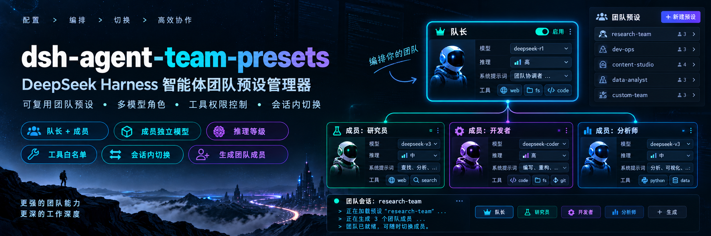
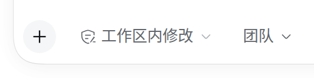
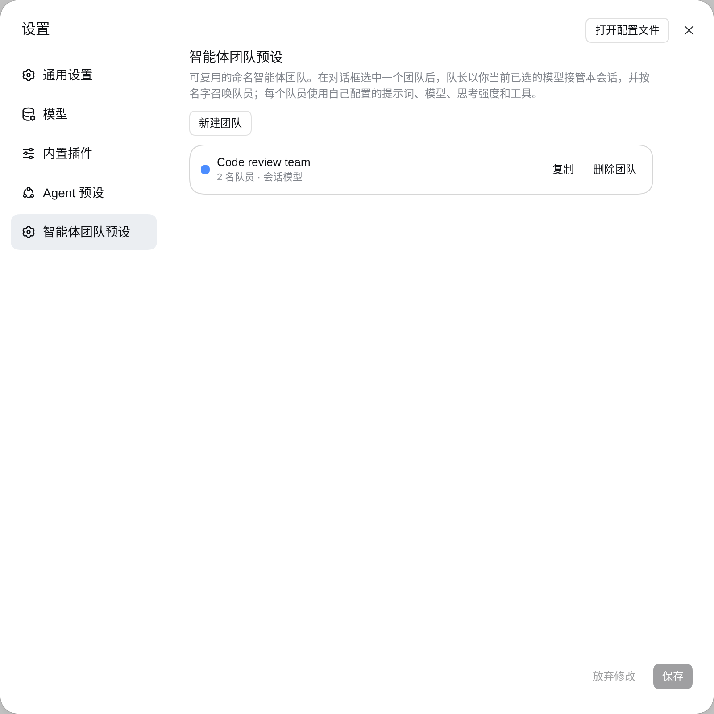
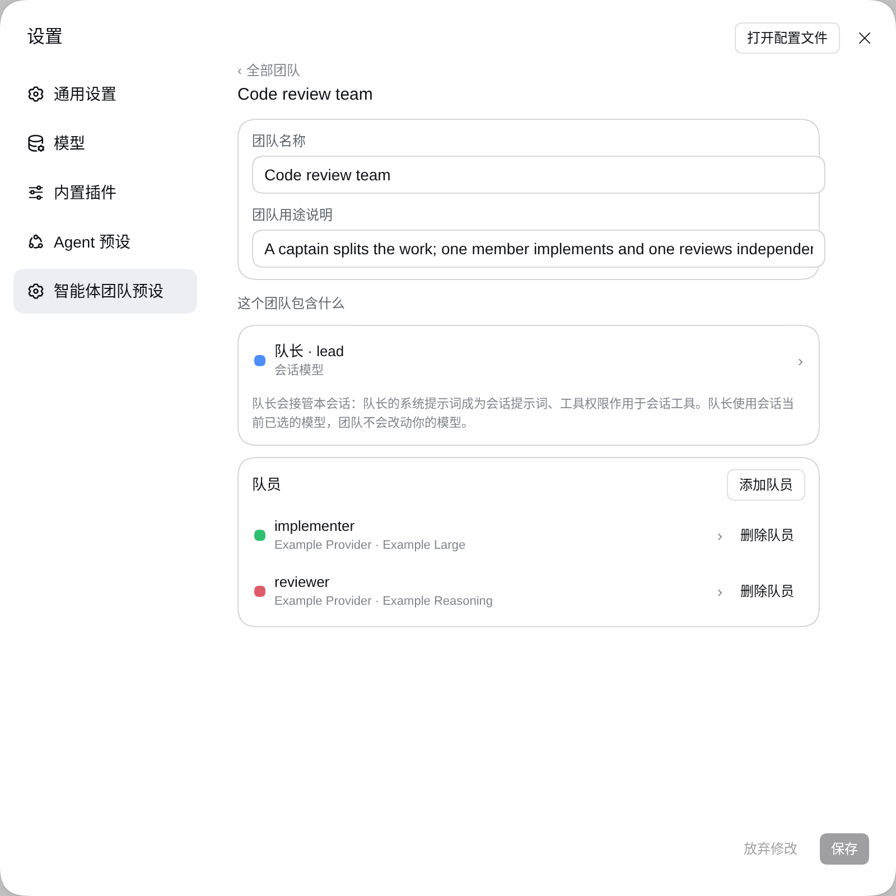
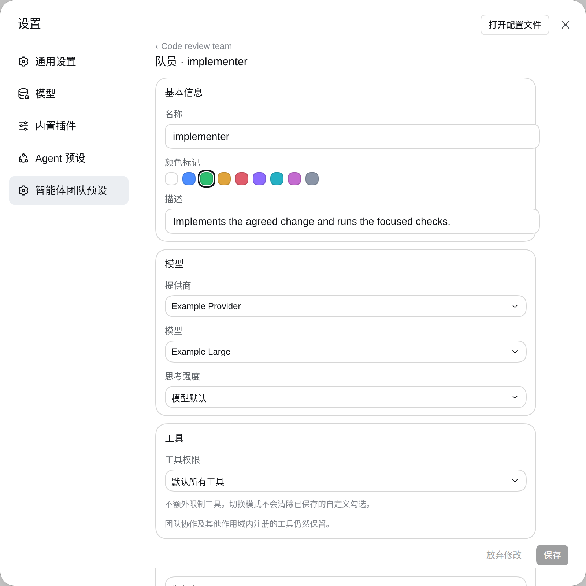
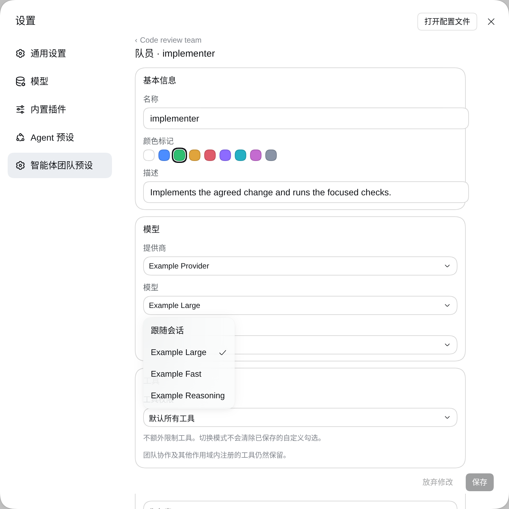

# dsh-agent-team-presets



[English](README.md) | 中文

> **状态：社区插件 v0.1.3。** 固定版本安装：
> `dsh plugin --profile <profile> add github:bloodarea/dsh-agent-team-presets#v0.1.3`。
> 支持的 Harness peer 范围为 `>=0.2.0-rc.1 <0.3.0`，由插件管理器校验；Harness 版本不是本插件版本。
> 包名为 `dsh-agent-team-presets` 的插件详情应显示 `v0.1.3`。
> 若卡片显示 `@deepseek-ai/dsh-experimental-agent-team-presets`，加载的是 monorepo 开发包，
> 其版本跟随 Harness（例如 `0.2.0-rc.2`），不是本社区发布版。
> `lib/` 已预构建，安装无需构建；重建源码需要 Harness 检出目录 —— 见
> [DEVELOPMENT.md](DEVELOPMENT.md) 与 [CHANGELOG.md](CHANGELOG.md)。

## 概述

`dsh-agent-team-presets` 增加一个 Settings 页面来配置具名 Agent Team，并增加一个 composer 控件把某个 Team 应用到会话。一个 Team 有一个 captain 和任意数量的成员：captain 携带自己的提示词与工具策略，而每个成员在此之外还携带自己的 provider/model 路由与推理强度，每次召唤该成员时都从存储的 Team 读取。应用一个 Team 会安装 captain 的提示词、限制其工具，并注册 `spawn_team_member`，它用该成员自己的 persona、路由、强度与工具召唤成员。captain 以会话已经选好的模型工作。

<a id="project-introduction"></a>
## 项目介绍

> 让 DeepSeek Harness 的 Agent Teams 从临时组队，升级为可配置、可复用的专业 AI 团队。

**dsh-agent-team-presets** 是一款面向 DeepSeek Harness 的可视化智能体团队预设管理插件，支持自定义角色、独立模型、推理等级、系统提示词与工具权限，让专业 AI 团队一次配置、随时复用。

<a id="why-this-plugin"></a>
## 为什么需要这个插件？

DeepSeek Harness 原生 Agent Teams 已经具备多智能体协作能力，但在团队的个性化配置与重复使用方面仍有提升空间。

本插件主要解决以下痛点：

- **团队难以复用**：原生团队侧重运行时创建与协作，缺少便捷的可视化团队预设管理；本插件支持保存、复制和复用团队配置。
- **角色配置繁琐**：无需每次重新描述成员职责，可提前设置每个角色的名称、描述和系统提示词。
- **多模型分工不便**：不同成员可独立指定模型与推理等级，按任务需求组合不同 AI 模型；队长继续使用当前会话选择的模型。
- **工具权限缺乏细粒度配置入口**：为队长和成员分别设置全局工具白名单，让不同角色拥有不同的工具使用范围。
- **团队切换不够便捷**：通过会话输入区快速选择预设团队，无需反复手动配置角色。

**核心理念：** 原生 Agent Teams 负责协作运行，dsh-agent-team-presets 负责团队的配置、管理与复用。

<a id="screenshots"></a>
## 界面预览

**对话框里的团队控件** —— 为本会话启用一个预设团队，或清除选择。



**设置 → 智能体团队预设** —— 列出全部已配置团队，可新建、复制、删除。



**单个团队** —— 团队名称与用途、队长，以及队员名单。



**单个队员** —— 自带提供商、模型与思考强度。队长使用会话当前模型，因此只有队员携带路由。



**模型选择器** —— 列出当前部署实际提供的全部提供商与模型。



## 目录

- [项目介绍](#project-introduction)
- [为什么需要这个插件？](#why-this-plugin)
- [界面预览](#screenshots)
- [使用本包](#use-this-package)
- [理解实现](#understand-the-implementation)
- [进一步探索](#further-exploration)
- [模型体验](#model-experience)
- [已知限制与延期工作](#known-limitations-and-deferred-work)
- [开发备注](#dev-note)

-----

<a id="use-this-package"></a>
## 使用本包

把该 bundle 安装到已组合 `@deepseek-ai/dsh-experimental-agent-team-profile`（Team 服务、Team 工具与 Web roster）的 profile 中，然后打开 Settings → Agent team presets。

### 安装、升级与版本确认

```sh
dsh plugin --profile <profile> add github:bloodarea/dsh-agent-team-presets#v0.1.3
```

把 `<profile>` 替换为 GUI 实际运行的 profile（例如 `web`）。发布新版不会自动更新已安装插件：
先备份 profile 与团队配置，再移除已安装包，并在同一 profile 安装固定版本。
若旧包是开发链接，应移除 `@deepseek-ai/dsh-experimental-agent-team-presets`，
而不是 `dsh-agent-team-presets`。不要同时启用两个包：它们共享 `agent-team-presets`
设置入口与客户端注册。迁移开发 profile 时，保留该入口 id 下的团队配置和会话选择记录，
将模块名与启用的 bundle 改为 `dsh-agent-team-presets`。

切换包身份后，重启正在运行的 Harness 并刷新 GUI；仅刷新页面可能仍保留 Host 模块表中的旧
客户端入口，造成重复插件启动失败。确认插件详情同时显示 `dsh-agent-team-presets` 和
`v0.1.3`，且组件处于运行中。Harness 自身的 `0.2.0-rc.*` 是另一套兼容版本要求。

### 配置一个 Team

Settings → Agent team presets 是三个层叠页面，因此狭窄的 Settings 面板不会拥挤：

1. **Teams** —— 每个已配置的 Team 占一行（名称、成员数、会话模型）。在此创建、复制或删除。
2. **One Team** —— 它的名称与描述、captain 行以及成员 roster。添加成员会打开该成员的页面。
3. **One agent**（captain 或成员）—— 身份、工具与系统提示词各占一张卡片；成员页面额外有模型卡片，并可删除该成员。

每次编辑都先在共享页脚中暂存，再由 **Save** 控件写入；存储值保存在 profile 的用户设置文档中。Settings 在团队任务进行中仍接受保存，不会中断任务。只要会话的 captain 为 `running`，或任一 teammate 为 `running` / `provisioning`，该会话就处于执行中；队长 persona、briefing、成员预设提示词与角色描述、成员工具描述与名单、工具权限均保持已应用的定义，任务期间新召唤的成员也使用该定义。成员的**模型路由**与每个槽位的**颜色**被有意排除在这份冻结定义之外，因为二者在需要时才从存储的 Team 读取：修正后的 provider、模型或推理强度会被进行中的任务在下次召唤成员时直接采用，无需重启任务；颜色改动也会立即重绘。会话整体空闲后，在下一次团队任务开始前采用最新保存的定义；连续保存以最新值为准。共享同一预设的会话分别采用。

页脚汇总在线会话，报告所选 Team 的执行状态：

- **`idle`** —— 当前没有会话在执行该团队任务，保存后立即生效。
- **`busy`** —— 至少一个会话正在执行；空闲会话立即采用定义修改，执行中的会话在下一次任务前采用。执行期间保存的成员路由会在下次召唤该成员时生效，进行中的任务同样适用。只要队长仍在运行，队员结束就不会解除定义冻结。
- **`unknown`** —— 无法确认是否执行中，包括流尚未就绪、结束或失败、连接中断，或 Host 缺少该方法或某个 Team 的状态。页面不会把先前的空闲帧当成当前事实。定义修改仍不会改变进行中的任务，而执行期间保存的成员路由会在下次召唤时生效。

| 字段 | 含义 |
|---|---|
| Team 名称 | 在 Settings 与 composer 控件中显示的名称。 |
| Captain | 主持该会话的 agent：它的系统提示词成为会话提示词，它的工具作用域作用于会话工具。它以会话已经选好的模型工作，因此没有自己的路由。 |
| Members | captain 按名称召唤的角色模板。 |
| 名称 | 显示名；teammate target 由它派生（lower-kebab-case，回退为 `member-<n>`）。 |
| 颜色 | 在 Settings 中显示的强调色标记。 |
| 描述 | 模型据此行动的角色提示：队长会读到队长自己的描述、团队描述以及每个成员的描述，从而挑选描述最合适的成员；被召唤的成员会读到团队描述与自己的描述作为角色。 |
| Provider / Model | **仅成员。** 从部署当前公布的所有 provider 与模型中选出的路由。留空则让该成员沿用会话路由。 |
| 推理强度 | **仅成员。** 所选路由的适配器自有强度；留空则使用模型默认值。 |
| 允许的工具 | 为 captain 和每个成员分别选择 **Default: all tools** 或 **Custom allowed tools**。自定义模式把部署的全局工具显示为展开的复选框网格，并提供全选与清空控件。自定义模式下不勾选任何工具会拒绝所有可配置工具；默认模式不增加任何限制，并保留已保存的勾选。captain 与成员策略相互独立，因此成员可以拥有 captain 无法使用的工具。已保存但不可用的名称仍可移除；无效名称会拒绝应用，而不是放开为不受限访问。作用域内的协调工具仍然可用。 |
| 系统提示词 | 注册为提示词区段模板；完整的 `{{variable}}` 组会按已注册的提示词变量插值。被召唤的成员会在其团队 briefing 之后读到它。 |

### 选择一个 Team

composer 的 team 控件位于工具行中、权限控件之后。选择某个 Team 会写入该会话的选择记录；空闲会话立即应用其 captain 提示词与工具作用域，执行中的会话保留当前应用，直到整体空闲。选择 "No team" 也在同一时机移除 Team 应用，恢复会话的其他提示词与工具贡献。模型仍是 composer 已经显示的那一个，因为没有任何 Team 会写入模型选择。

### 分享单个 Team

团队行上的 **导出** 把该 Team 写成一份固定的 JSON 文档，**导入预设** 读取这样一份文档。共享文档只携带可跨部署复用的内容：团队名称与用途，以及队长和每个队员的名称、描述、系统提示词与颜色标记。模型路由与工具权限留在本地，因为它们指向本部署的提供商与工具；携带这些字段的文档会被拒绝，而不是被静默裁剪。

导入按名称匹配。文档的团队名已经配置过时，对话框询问是**替换该团队**还是**改名后新增**。队长名或队员名与目标团队重复时，同一个对话框逐个询问：**替换该队员**，或把导入的成员**改名后新增**。替换只写入文档携带的字段，因此目标团队保留自己的模型路由与工具权限，也保留文档未提到的每个队员。

导入结果先进入草稿，只有点击 **Save** 才会写入设置文档；导出写的是当前页面显示的内容，包括尚未保存的草稿。

### 让队长调整 Team 预设

会话的 captain 另外持有两个工具，用于本插件真正要解决的情形：Team 已经跑过一次，而它当时的描述或提示词还不对得上实际工作。

- **`get_team_preset`** —— 读出本会话 Team（或 `team_id` 指定的 Team）的全部可编辑字段，以及设置文档当前的修订号。会话尚未选择 Team 时，它报告 `no-selection` 并列出所有已配置 Team，因此 captain 会向用户询问要改哪一个，而不是自行猜测。
- **`update_team_preset`** —— 替换 `team_description`、`captain_description`、`captain_system_prompt`，以及每个成员的 `description` / `system_prompt`，并以 `get_team_preset` 返回的修订号作为写入围栏。

工具成功写入时，保存的是 Settings 页面编辑的同一份设置文档，并遵循上文按会话采用的时机。captain 若仍在执行当前任务，后续模型步骤继续使用旧定义。**已有 teammate 保留创建时的描述、persona 与工具过滤器**，即使通过消息唤醒也不变；会话采用新预设后，未来新建的成员才使用新定义。要调整已有 teammate 的工作，可发送新要求，而不替换其已存储的组合。

两个工具只注册在会话根 Agent（captain）的作用域内，teammate 看不到它们；写入还要求当前回合带有用户直接发起的输入，因此自动续跑或 teammate 汇报的回合无法改写这份共享预设。名称、成员路由与工具权限不在它们的编辑范围内 —— 改名会改变 teammate target 并撞上 Agent Teams 的名称永久占用规则，因此这件事仍由 Settings 页面负责。

工具的写入策略与 Settings 页面不同：只要选中或仍应用该 Team 的任一在线会话还有 `running` / `provisioning` 的 teammate，`update_team_preset` 就返回 `team-busy`，不保存。这项保守的模型发起写入检查只统计 teammate，不统计正在执行工具的 captain；否则每次调用都会自我阻塞。等待这些队员结束，或用 `interrupt_agent` 中断它们，然后再次调用 `get_team_preset`，用其修订号重试。进行中的任务保持原定义；Settings 页面仍可保存供之后采用的修改，且在那里保存的成员路由会在该任务下次召唤成员时生效。`get_team_preset` 会报告正在执行的队员数。

工具还会拒绝被其他写入者推进的修订号（重新读取后重试），以及本次提交的常驻提示词中无法解析的 `{{variable}}` 组。未知变量会在模板被使用时使请求失败，而不是降级。校验只针对本次调用提交的提示词，因此对 Settings 页面写入的既有文本不会造成无关编辑被拒。

<a id="understand-the-implementation"></a>
## 理解实现

### Host 组合

Host 半边拥有实时配置与按会话的应用：

| 文件 | 作用 |
|---|---|
| [`src/index.ts`](src/index.ts) | 插件入口：实时 Config，依据 Agent 生命周期、设置提交与 `team/member` 结算，按会话冻结与采用定义。 |
| [`src/execution.ts`](src/execution.ts) | 事件驱动的执行状态监控：队长与队员状态、已应用与已存储定义的比较，以及聚合全量帧。 |
| [`src/config.ts`](src/config.ts) | 易变的 `teams` 与 `selections` 字段、continuable provider 名称，以及存储 Team 的 captain 路由清理。 |
| [`src/application.ts`](src/application.ts) | 把一个 Team 应用到一个活动 Agent：提示词区段、工具作用域与 `spawn_team_member` 工具。 |
| [`src/preset-editor.ts`](src/preset-editor.ts) | 预设工具背后的纯编辑逻辑：可编辑字段白名单、成员解析与 roster 的描述长度上限。 |
| [`src/preset-tools.ts`](src/preset-tools.ts) | captain 的 `get_team_preset` 与 `update_team_preset`、它们的授权检查，以及设置写入。 |
| [`src/presets.ts`](src/presets.ts) | 与浏览器半边共享的纯函数：teammate target、成员查找、选择记录改写、roster 文本。 |
| [`src/tool-catalog.ts`](src/tool-catalog.ts) | Host Remote 服务 `teamPresetsToolCatalog`：可限制的全局工具，以及供 Settings 页面使用的 `teamPresets.execution` 流。 |
| [`src/client/*`](src/client) | 浏览器半边：Settings 页面、composer 控件与共享表单控制器。 |

应用一个 Team 会把 captain 的提示词作为 `deployment:persona-prefix` 安装到该 Agent 的作用域上，因此它只遮蔽该会话的部署 persona。captain 与每个成员各自解析自己的工具模式。自定义的 captain 允许列表会过滤其全局工具；被召唤的成员收到自己的自定义允许列表，与 captain 的选择无关。captain 以会话已经选好的模型工作，因此本插件完全不写入模型选择：该引用始终只由 composer 的模型控件拥有，而渲染后的 captain 提示词会在请求之前记录为 `system/message` 表层事件，因此模型可见输入始终可以从会话日志重建。 Host 半边还提供 `teamPresetsToolCatalog` Remote 服务，它列出的正是 `ctx.tools.restrict()` 校验所依据的全局工具，因此 Settings 页面不会给出 summon 路径会拒绝的名字。

`teamPresets.execution` 是发送全量快照的 Remote 流：`{ teams: [{ teamId, state, busySessions, executingMembers, pendingSessions }] }`。计数覆盖选中或仍应用该预设的在线会话；`pendingSessions` 统计尚无应用，或已应用内容与已存储选择或冻结定义不同的会话，会话实时读取的成员路由与颜色不计入。帧仅携带 Team 身份与聚合计数，不传 persona、会话名称或会话内容。生命周期与设置事件刷新流，无需轮询；无法读取 roster 时报告 `unknown`，但已有确定的执行活动时报告 `busy`。

### 选择与存储

Team 与按会话的选择记录保存在插件的易变 Config 字段中；settings 服务把它们投射到 profile 的用户设置文档，并通过 `loader/volatile-update` 提交回运行中的引用。浏览器半边通过 `ctx.configForms.get('agent-team-presets')` 编辑它们，因此 Settings 页面与 composer 控件共享同一个按修订号围栏的写入队列。每个 agent 独立于 `tools` 存储 `toolMode`。缺少 `toolMode` 的记录保留其仅列表的行为：空列表表示 default-all，非空列表表示 custom。若存储的 captain 仍带着 captain 不再拥有的 `provider`、`model` 或 `reasoningEffort`（来自更早的文档），插件会在加载时把它们清掉并回写一次。

### 按 teammate 的设置

`@deepseek-ai/dsh-experimental-agent-team` 增加了三个可选的 `SpawnTeammateRequest` 字段 —— `agentOptions`（provider、model、推理强度）、`persona` 与 `toolFilter` —— 并且现在把请求的成员模型记录到持久成员快照中，因此 roster 行可以为一个不在线的 teammate 命名其模型。`spawn_team_member` 把它们传给 `ctx.agentTeams.spawnTeammate`，因此成员始终留在 Team roster、mailbox 与共享任务板之内。

### 运行时不变式

**运行时不变式：** 不发布 companion。每一项贡献都是 Agent 作用域上的普通 Cordis 注册，因此销毁该作用域就已经移除提示词区段、工具限制与成员工具；组装后的 captain 与成员策略改由生产 Loader 组合测试覆盖。

-----

<a id="further-exploration"></a>
## 进一步探索

- [Agent Teams 子系统](../../../docs/subsystems/agent-team.zh.md) —— 本包所组合的 `ctx.agentTeams` 服务、roster、mailbox 与共享任务板。
- [agent-team 包](../agent-team/README.zh.md) —— 该服务、其持久类型，以及 `agentOptions`、`persona` 与 `toolFilter` 委派字段。
- [tool-agent-team 包](../tool-agent-team/README.zh.md) —— 模型用来创建、发消息并协调 teammate 的工具。

-----

<a id="model-experience"></a>
## 模型体验

### Captain 与成员的提示词

#### 模型看到什么

captain 的系统提示词取代该会话的部署 persona 前缀，而一个 `agent-team-presets:briefing` 区段陈述团队用途、captain 自己的角色，以及每个可召唤成员 target 及其描述 —— 队长据此挑选描述最合适的成员。被召唤的成员则收到自己的 persona 前缀：它加入的团队、它自己的角色，以及它配置的系统提示词。全部渲染进会话的 `system/message`，因此恢复的会话会从日志重建它们。

##### 含一个成员的 Team 的 briefing 区段

```markdown
Team preset "Review team" is active for this Session: Reviews changes before they land

You are its captain "team-lead": Keeps the review queue moving

Summon a member with spawn_team_member(member, task). The targets below are fixed; use them verbatim.

- member-1 (审查者): checks diffs
```

##### 被召唤成员的 persona 前缀

```markdown
You are "member-1" (审查者) on the Agent Team "Review team": Reviews changes before they land

Your role: checks diffs

You review one diff at a time and report findings.
```

#### Token 影响

两个区段都会把各自的文本加入该会话每次请求的系统提示词。空的 captain 提示词与没有成员的 Team 不增加任何内容。

#### KV Cache 影响

即使保存了更新的预设，执行中任务所应用的 Team 区段模板也保持不变。在任务之间采用变更后的 Team 时，队长提示词与 briefing 可能被重写；实际缓存复用还取决于提示词变量与提供商能力。

### `spawn_team_member`

#### 模型看到什么

一个带有 `member`、`task`、`description` 与 `context` 参数的工具。结果是紧凑的 JSON 记录，命名 teammate target、其状态与模型。

#### Token 影响

在应用 Team 期间，该工具 schema 与描述加入会话的工具表。

#### KV Cache 影响

执行中的任务所应用的成员名单与工具 schema 保持不变。在任务之间采用变更后的名单或工具策略时，请求中的工具可能变化，并影响缓存复用。

## 已知限制与延期工作

<a id="known-limitations-and-deferred-work"></a>

- **Team 定义是 profile 全局的，而选择记录是按会话的。** 该选择保存在用户设置文档而不是会话日志中，因此 fork 或复制的会话不会继承它，而在另一台机器上重新应用某个会话需要同一份设置文档。
- **选择本身没有会话日志记录。** captain 的渲染提示词会被记录；Team 身份不会，因此读者无法在没有设置文档的情况下判断某个会话用过哪个 Team。
- **成员系统提示词是 persona 模板。** 成员的提示词若包含未知 `{{variable}}`，该成员的首次请求会失败；字段会在保存前给出警告。
- **允许列表只遮蔽全局工具。** 诸如 Team 协调工具（`send_message`、`team_task_*`）这样的作用域注册对受限 agent 仍然可见，因为 `ctx.tools.restrict()` 只对全局名称取交集，而保留作用域注册。因此成员仍保留其答复 Lead 所需的工具。
- **会话模型不属于 Team。** captain 以 composer 选定的那个模型工作，只有成员带路由，因此编辑 Team 永远不会改动你的模型。
- **本版本之前保存的 captain 会一次性失去其路由。** 插件在加载时通过常规设置写入重写这样的 Team，因此 profile 补丁不再在 captain 上写出 `provider`、`model` 与 `reasoningEffort`。
- **已有 teammate 保留创建时的组合。** 应用保存的预设会更新 captain 与未来新建的成员，不会更新已有 teammate 的描述、persona 或工具过滤器；发送新要求可调整工作，但不会替换该组合。
- **共享预设按会话采用，成员路由无需等待。** Settings 保存不改变进行中任务的定义；captain 在会话整体空闲后、下次任务前采用最新定义。成员路由在该成员被召唤时读取，因此在 Settings 修正路由后，进行中的任务下次召唤成员即可使用，无需重启。队长工具还会在任一受影响会话有 running / provisioning 的 teammate 时拒绝保存，并要求用户直接发起的轮次。

-----

<a id="dev-note"></a>
### 开发备注

<details>
<summary>维护者细节——点击展开</summary>

无。

</details>
